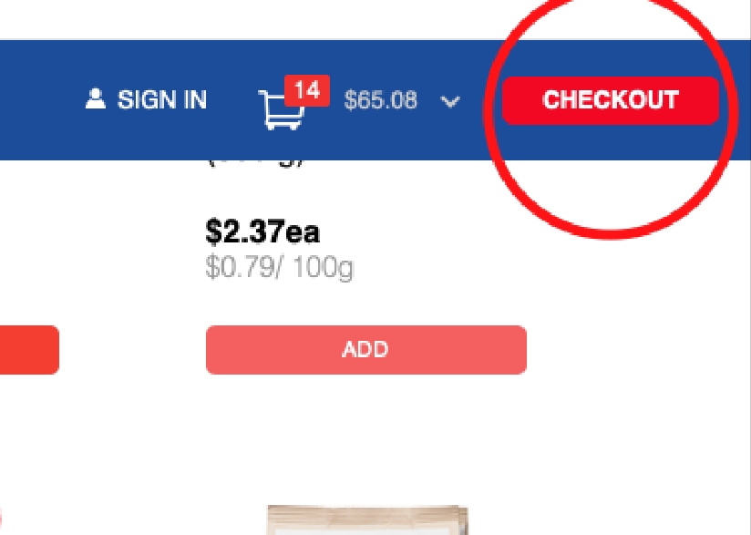
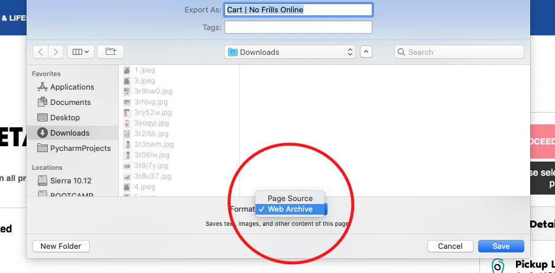

# NoFrills Price Combiner
Why all go grocery shopping when it only takes one ~~mule~~ person to physically go to the store and pick stuff up? 

This is a simple script to combine a bunch of NoFrills carts into 1 csv for communal shopping purposes in these interesting times.
It was designed to be lightweight, and work for any number of people.

Once everything has been put together, then a .csv file with everything on it will be created

## How to use (User) ##
If you've been sent this page and asked to follow instructions, then these are them:

1. Shop at your leisure at your local NoFrills (important to ensure items are available).

2. Shop to your hearts content.

3. Click on your cart in the upper left and then click on "Checkout".

4. Right-click anywhere on the page and select "Save Page As...".

5. Save as "something.webarchive".

6. Send that file to the person who sent you this link.

## How to use (Developer) ##
If you're the one running the script, this is what you need to know
0. As always, install requirements from requirements.txt
1. Save each .webarchive file with the name of the person who sent it to you.
2. Put this in the "Data" Folder.
3. Run Main.py.
4. A .csv of all of the selections should be created.

Output should look like this:

## Issues ##
- would be nice if this worked with more websites
